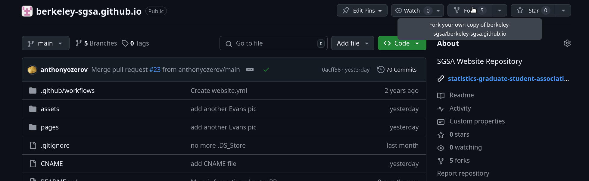
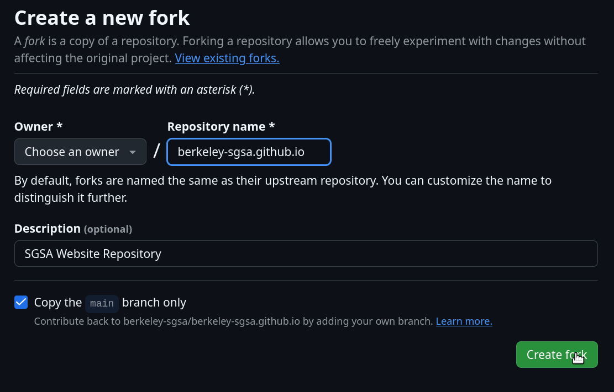
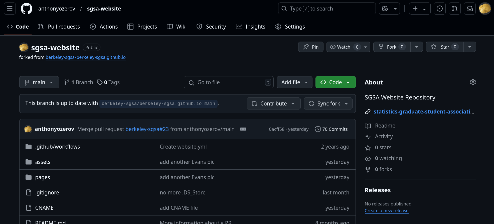
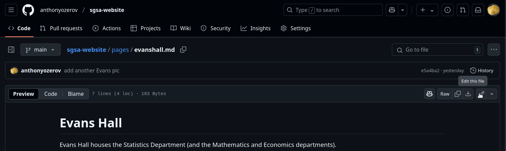
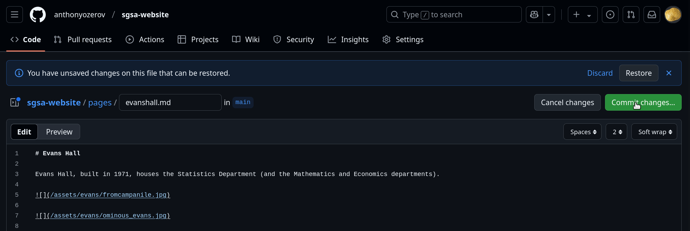
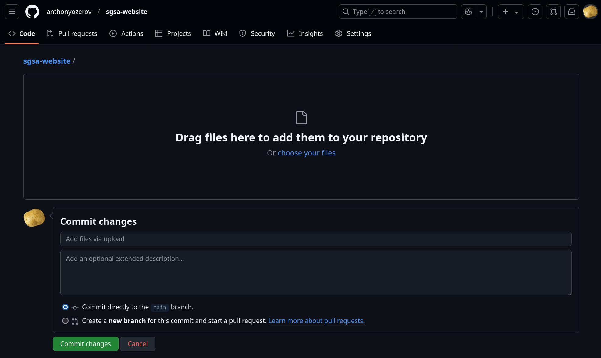
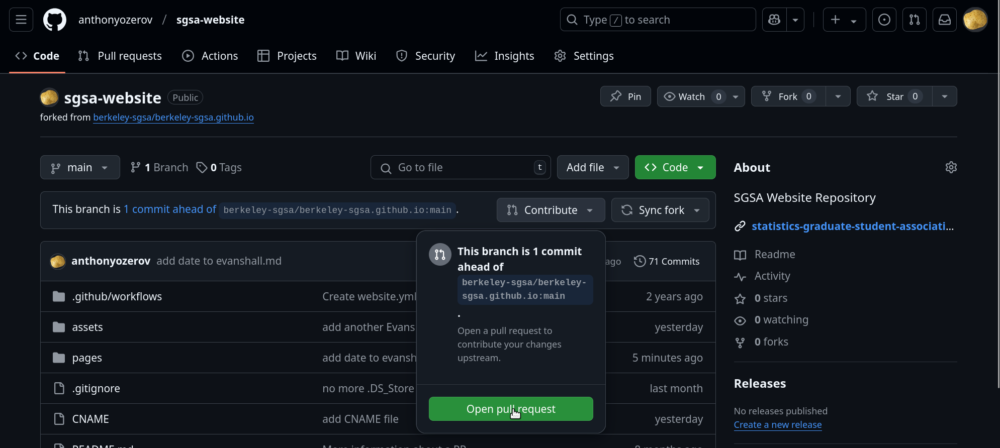
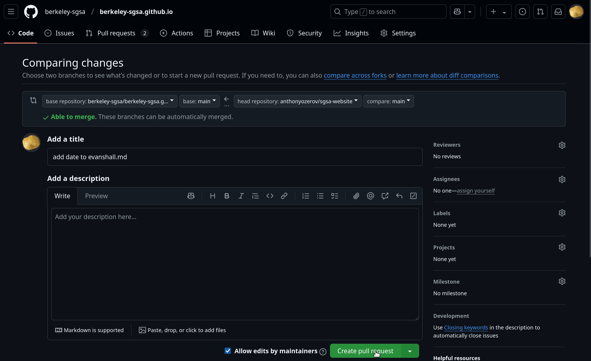

# Repository for SGSA Website

This repository hosts the [SGSA website](https://berkeley-sgsa.github.io). 
Everyone is welcome to contribute to this website by contributing with a pull request (PR). 
The next section introduces how to contribute to the repository. If you’ve never done this before, it’s easy!

## The path to PR (jan 2025)
 
So you've decided to propose a change to the website! Ultimately, you need to make a PR, containing your changes, for 
the SGSA Website Committee to approve or deny. Here's how you go about that. 

1. If you've never proposed a change before, **make a fork** of this repo.
  - To do this, on [this repo's home page](https://github.com/berkeley-sgsa/berkeley-sgsa.github.io), click the `Fork` button on the upper right (see screenshot). Name it whatever you want! (In the screenshots we called it `sgsa_website`.)
  - If you have previously forked the repo, then before making a new change, first click the `Sync Fork` button on your forked repo's home page. 
2. On your fork, you can **add, upload, and edit files**. All pages are stored as markdown files in the `pages` directory, with `.md` extension; all images and other files are stored in `assets`. 
  - The simplest way to do this is directly on Github! To add or upload a new file, click the `Add File` button on the upper right of [this repo](https://github.com/berkeley-sgsa/berkeley-sgsa.github.io) (it might look like a `+` for you). To edit a markdown file, navigate to it in the file explorer, and click the pencil icon on the upper right to begin edits. When you're done, click the green `Commit Changes` button and write a commit message. (See multiple screenshots). If you do it this way, your changes are automatically updated on Github. 
  - If you're making substantial changes, you might prefer to clone your fork to your PC, work locally, and then push your changes back to your fork on Github.
3. Once your changes are updated on your fork on Github, it’s time to **make the pull request**! At your fork, click the `Contribute` button—it probably says it’s ahead by one or more commits—then `Open pull request`, and `Create Pull Request` (See multiple screenshots).
  - If Website Committee updated the website while you're working, then it *won't* simply say that you're ahead commits, but also that you're behind. You need to `Sync Fork` again, and get the up-to-date website, before making your pull request. 

### Continuous integration

This repository has a [workflow](https://github.com/berkeley-sgsa/berkeley-sgsa.github.io/blob/main/.github/workflows/website.yml) implemented that automatically deploys the website. 
Every new commit message to the main branch of this repository will trigger the action to deploy the website with the changes from the last commit.

## Previewing

It is okay to edit the site and push without previewing anything. Most edits are simple changes to markdown files, so it is hard to mess up! And, even if you mess up, you can always just go in and fix it live. So, previewing is really not necessary.

However, if you would like to preview the modified website before pushing, it is possible. What you need to do is (a) build the html pages then (b) look at them. For (a), you can take a look at the GitHub Action located in the repository at `.github/workflows/website.yml` for help. This file describes the minimal steps required to build the HTML files, and is used by GitHub Pages to do so. These are the steps you need to do:

1. Open a command line in a local copy of the repository
2. `pip install -r book-requirements.txt` (only ever need to do once)
3. `jupyter-book build .` (repeat if you make changes and want to preview again)

This will use the markdown files and various config files to build the HTML website. The built pages will be located in the folder `/_build/html` in your local copy of the repository. You can now open these with your web browser and take a look!
